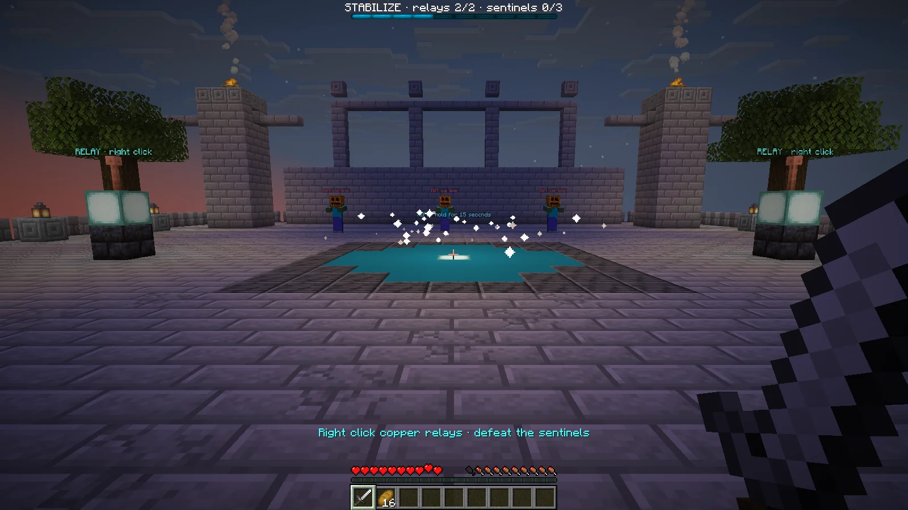

# Encounter State

Paper plugin for Minecraft Java Edition 1.21.11: a two-phase PvE encounter on a procedurally built observatory map, driven by a small state machine in plain Java.



- Case page: https://velmren.com/en/encounter/
- Built plugin: https://velmren.com/assets/java/encounter-state-demo-0.2.0.jar

## What it does

The plugin builds a stone observatory in its own world, `encounter_observatory`, and runs one encounter there.

1. A player right-clicks the lodestone at the entrance. All survival and adventure players in the world join the attempt; players who arrive later wait for the next one.
2. Stabilize: activate two copper relays and defeat three Rift sentinels, in any order. Both objectives must finish before the next phase opens.
3. Seal the rift: stand in the cyan circle for 15 seconds while two Rift echoes attack. Leaving the circle pauses the count; whole seconds are kept, the current partial second is lost. Any participant can hold the circle.
4. On completion a beacon lights up and every participant still in the world gets one amethyst shard. Right-clicking the lodestone again starts a new attempt.

The attempt resets when all participants leave or the whole group dies. Players who die in the map respawn at the entrance. Block breaking in the encounter world is cancelled.

Progress is shown in a boss bar, chat messages, relay lighting and sounds. Relay IDs and entity UUIDs make sure nothing is counted twice. A sentinel that dies without a player kill is replaced and gives no progress.

### Commands

| Command | Description |
| --- | --- |
| `/encounter join` | Teleport to the observatory |
| `/encounter kit` | Iron sword, 16 bread and iron armour for empty slots; existing equipment is kept |
| `/encounter start` | Start an attempt, same as the lodestone |
| `/encounter status` | Current phase and objective counters |
| `/encounter reset` | Reset an active attempt; needs `encounter.admin` (operators by default) |

## How it works

`core/` contains the engine and has no dependencies. `EncounterEngine` takes an immutable definition of phases and objectives, accepts progress, caps it at the required value, moves to the next phase only when every objective of the current one is complete, and emits completion once. `paper/` is the adapter: `PaperEncounterPlugin` reads the definition from `config.yml`, and `ObservatoryArena` builds the map and turns relay clicks, sentinel kills and occupied server ticks into engine calls.

The engine accepts any phase and objective layout. The observatory map has exactly two relay sites and three sentinel spawns, so the plugin refuses a `config.yml` that does not match 2 relays, 3 sentinels and 15 seconds. A different layout needs its own map adapter.

The world is disposable: every server start rebuilds the scene and resets progress. There is no database, persistent party system or hot reload.

## Tech stack

Java 21, Paper API 1.21.11. The core compiles against Java 17. Tests are a plain Java program without a test framework. A Fabric Loom project in `dev-client/` starts a local Minecraft client for testing.

## Getting started

Prerequisites: JDK 21 or newer and PowerShell (Windows PowerShell 5.1 or PowerShell 7). A Paper 1.21.11 server to run the plugin.

Run the core tests (27 checks, compiled with `-Xlint:all -Werror`):

```powershell
./build-and-test.ps1
```

Build the plugin:

```powershell
./build-paper.ps1
```

The script downloads the nine compile dependencies listed in `dependencies.json` into `.deps/`, checks their SHA-256 hashes, compiles all sources with warnings treated as errors and writes `build/encounter-state-demo-0.2.0.jar`. Copy the JAR into the server's `plugins/` folder and restart the server. `pom.xml` declares the same Paper API dependency for IDEs.

### Local test server and client

`start-dev-server.ps1` downloads Paper 1.21.11 build 132 and the matching Mojang server JAR, checks both hashes, runs the two build scripts, installs the plugin and starts a server on `127.0.0.1:25576` in `.dev-server/`. Read the [Minecraft EULA](https://www.minecraft.net/eula) before passing the flag:

```powershell
./start-dev-server.ps1 -AcceptEula
```

The server runs in offline mode and refuses to start unless it is bound to the loopback address.

To start a client with Gradle 9.5.1 and JDK 21 or newer:

```sh
gradle -p dev-client runClient
```

Fabric Loom downloads the official Minecraft 1.21.11 client and assets and starts it as the offline user `EncounterDev`. Connect through Multiplayer, Direct Connection, `127.0.0.1:25576`.

## Project structure

```
src/main/java/dev/velmren/encounter/core/       state machine, no dependencies
src/main/java/dev/velmren/encounter/paper/      Paper plugin and observatory map
src/main/resources/                             plugin.yml and config.yml
src/test/java/                                  EncounterEngineTest
dev-client/                                     Fabric Loom project for a local test client
build-and-test.ps1, build-paper.ps1             core tests and plugin build
start-dev-server.ps1                            local Paper server with the plugin
dependencies.json                               pinned compile dependencies with SHA-256
docs/                                           README screenshot
```

## License

MIT, see [LICENSE](LICENSE). Minecraft, Paper and their libraries are downloaded from official sources by the scripts and are not part of this repository.
